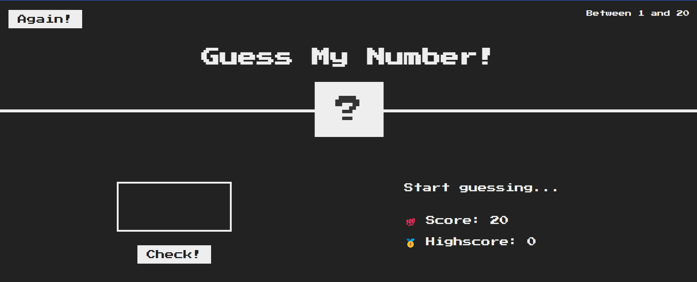

# 🎯 Guess My Number

Welcome to **Guess My Number** – a simple and fun game where you try to guess a secret number within a limited number of attempts. Test your intuition and see how quickly you can find the right number!

## 🌟 Features

- **Interactive Gameplay**: Enter your guess and receive immediate feedback.
- **Limited Attempts**: You have a set number of opportunities to guess the correct number. Make each one count!
- **Winning & Losing Conditions**: Guess the number within the allowed attempts to win. If you run out of attempts, the game ends, and you lose.
- **Responsive Design**: Enjoy the game on any device, whether you're on a desktop or mobile.

## 🚀 How to Play

1. The game will generate a random secret number within a specified range.
2. You have a certain number of attempts to guess the correct number.
3. After each guess, you'll receive feedback:
   - **Too high!**: Your guess is higher than the secret number.
   - **Too low!**: Your guess is lower than the secret number.
4. Keep guessing until you either find the correct number or run out of attempts.
5. If you guess the correct number, you'll win the game! If your attempts run out, you lose.

## 🛠️ Technologies Used

- **HTML**: For structuring the game interface.
- **CSS**: For styling the game and making it visually appealing.
- **JavaScript**: For handling game logic and user interactions.

## 📂 Project Structure
|-- index.html # Main HTML file for the game
|-- style.css # CSS file for styling the game
|-- script.js # JavaScript file for game logic
|-- README.md # Project documentation (this file)

## 🎮 Try the Game

1-Simply open the `index.html` file in your browser to start playing the game. Good luck, and may the odds be in your favor!

2-you can use the page that is opened for this repo already

## 🤝 Contributing

If you'd like to contribute to this project, feel free to fork the repository and submit a pull request. All suggestions and improvements are welcome!

## 📄 License

This project is licensed under the MIT License.

